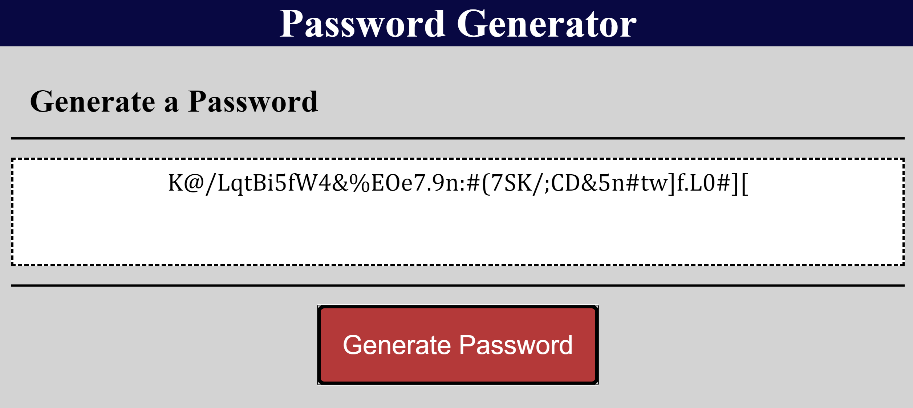

# Random-Password-Generator

This program creates a randomly generated password. The user will be prompted for their password length.
The length must be atleast 8 characters long, but no more than 128. The user will then have answer 4 confirms
to determine if the would like to use lower case character, upper case characters, numbers, and/or special characters.
The password will then be displayed on the screen using the getElementById method. 

link: https://bac5806.github.io/Random-Password-Generator/.
